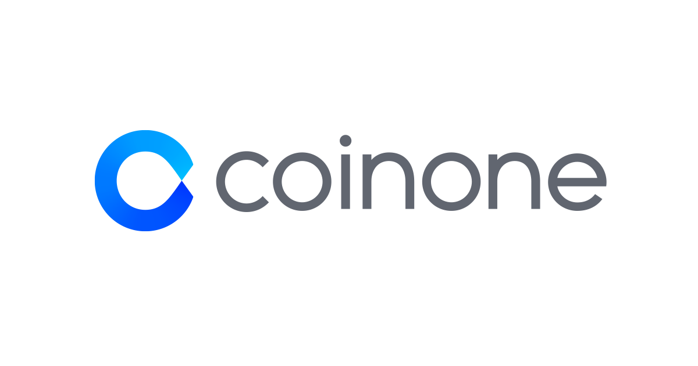

# CoinOneAPI




based on [CoinOne API Docs](https://doc.coinone.co.kr/#section/About-Private-API)

## Install
```bash
pip install -r requirements.txt
```

## Tips

- venv create
```bash
python -m venv .venv
.\.venv\Scripts\activate
```

- requirements.txt generate
```bash
pip freeze > requirements.txt
```

- some lectures? 

[quantstart](https://www.quantstart.com/)  
[investopedia](https://www.investopedia.com/)  
[Python을 이용한 주가 백테스팅 시스템 구축하기](https://www.inflearn.com/course/python-%EC%A3%BC%EA%B0%80-%EB%B0%B1%ED%85%8C%EC%8A%A4%ED%8C%85#description)